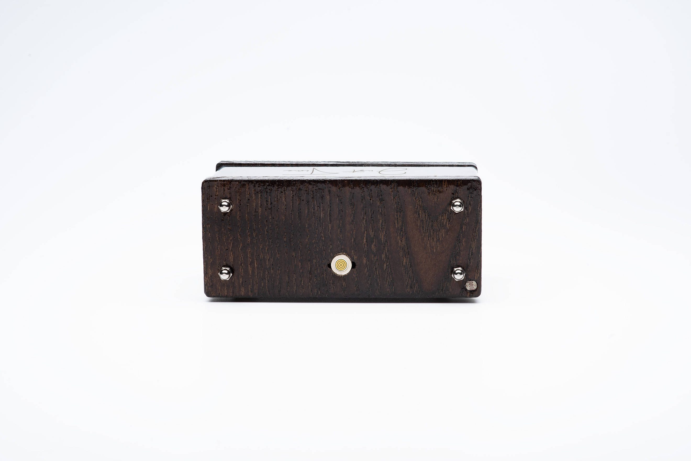

# Nixie clock (esp32 based)

This project is my implementation of retro style clock. For time indication were used USSR indicators IN-12 and IN-4.
I had several versions(improve logic and elements on pcb), later I will add semantic schemas

## Features

- [x] use precise real time clock DS3231 + battery/supercapacitor
- [x] has gps sync option
- [x] work from usb charger (with QC 2.0 and above)
- [x] has light sensor and can adjust brightness 
- [x] get rid of electrolytic capacitor
- [x] can support 4 or 6 lamps (dynamic indication)
- [x] has color backlight ws2812b
- [x] doesn't have any buttons, sync automatically
- [x] has web interface with OTA and some basic settings (need to improve web UI)
- [x] magnetic usb

## version 1 + IN-12 lamps

